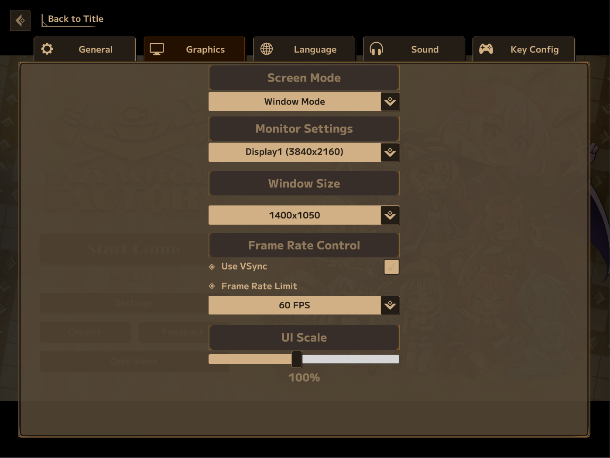

# LWF UI Scale

BepInEx plugin for **Lazy Witch's Factory**. Adds a **UI Scale** row to Settings → Graphic:
15% to 200%, applied when you let go of the slider.

Built against `0.21.0` (Steam app 3971650).



## Install

1. Install [BepInEx 5.4.23.5 win_x64](https://github.com/BepInEx/BepInEx/releases/tag/v5.4.23.5) into the game folder, next to `LazyWitchsFactory.exe`.

   On Linux, add `WINEDLLOVERRIDES="winhttp=n,b" %command%` to the game's Steam launch options. Without it BepInEx never loads and nothing happens, with no error.

2. Run the game once.

3. Put `LwfUiScale.dll` in `BepInEx/plugins/`.

## Config

`BepInEx/config/dev.meow.lwfuiscale.cfg`

| Key | Default | |
|---|---|---|
| `Scale` | `100` | Percentage, 15 to 200. Set it from the settings row |

## Build

Set `GameDir` in `Directory.Build.props`, then:

```bash
dotnet build src/LwfUiScale/LwfUiScale.csproj -c Release
```

## Licence

MIT. Not affiliated with the developers of Lazy Witch's Factory.
